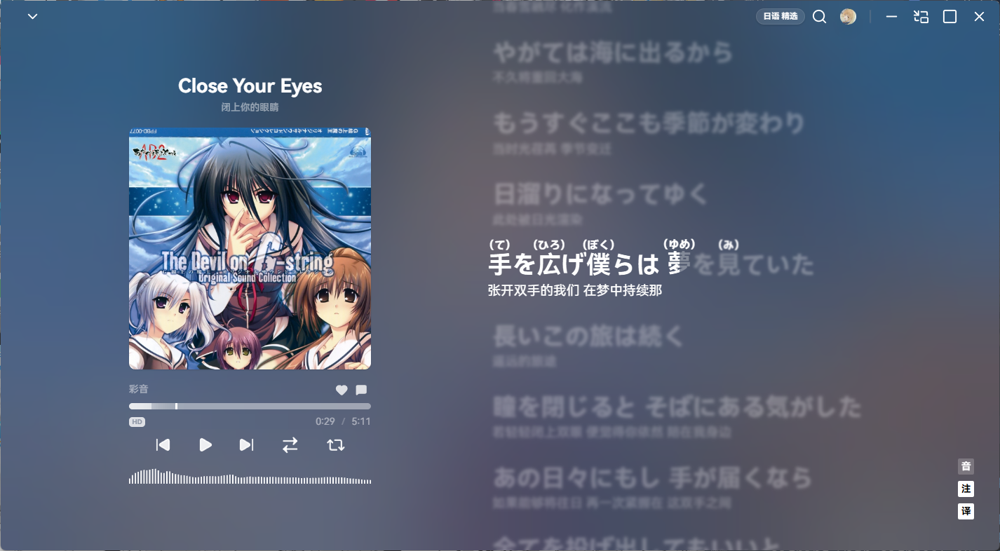
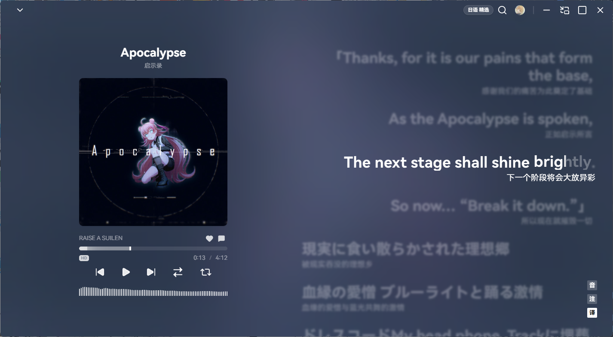
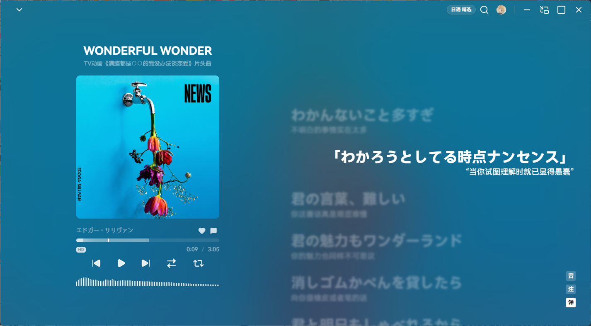
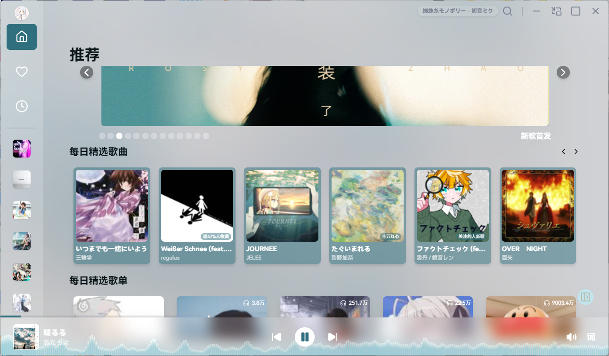
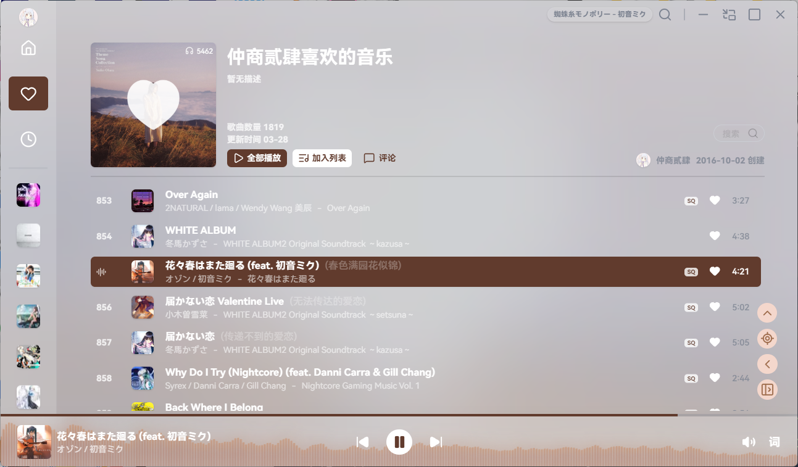
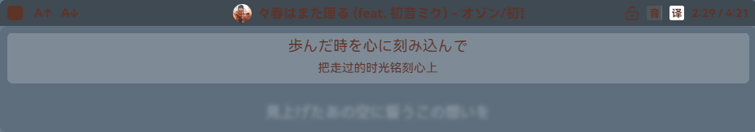
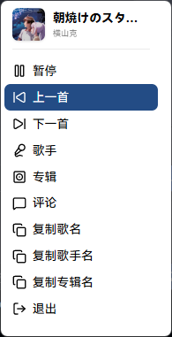

#  AiraMusic

一个基于 Electron、React、Vue 和 TypeScript 构建的桌面端第三方网易云音乐播放器。

## 项目状态

🚧 开发中（WIP）

## 界面展示

### 播放页





### 首页



### 主界面



### 歌词页



### 托盘页



## 核心特性

- 多窗口架构：主界面、播放页、桌面歌词、托盘、图片查看等窗口独立运行，互不干扰。
- 混合前端技术栈：主界面采用 React ，部分轻量窗口使用 Vue ，基于 Vite 多入口构建。
- 分层与模块化设计：前后端逻辑解耦，采用多子包（workspace）组织，便于扩展。
- 性能优化：使用 Rust（WASM）与 Go 实现部分高性能模块。
- 音乐能力支持：基于 @neteasecloudmusicapienhanced/api 接入网易云音乐。
- 使用 lucide 图标库。

## 构建

### 环境要求

- Node.js
- Rust
- wasm-pack
- Go

安装 wasm-pack：

```bash
  cargo install wasm-pack
```

### 安装依赖

```bash
  # 使用yarn，避免electron-builder安装依赖时出现依赖缺失问题
  yarn install --frozen-lockfile
```

### 开发模式

```bash
  pnpm build:wasm && pnpm build:store  # 首次运行
  pnpm dev
```

### 构建项目

```bash
  pnpm build
```
