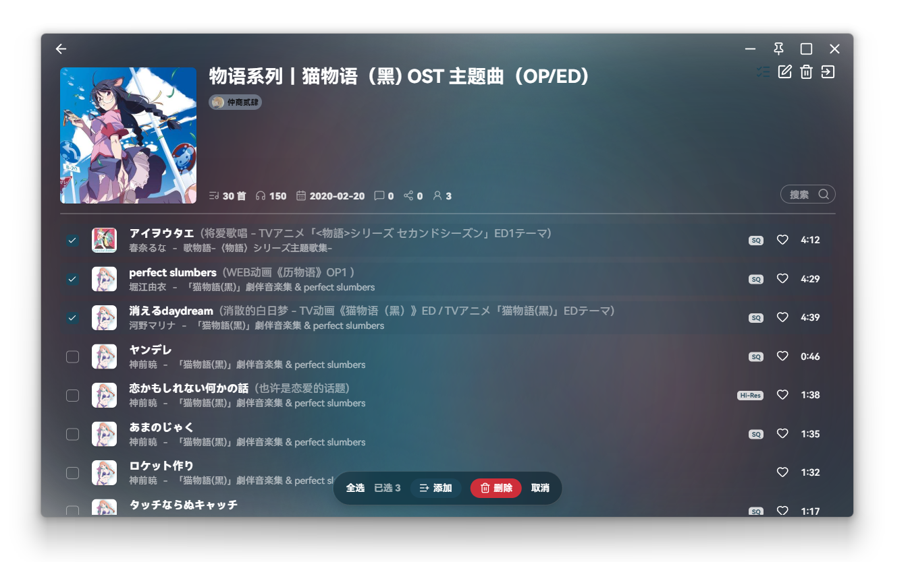
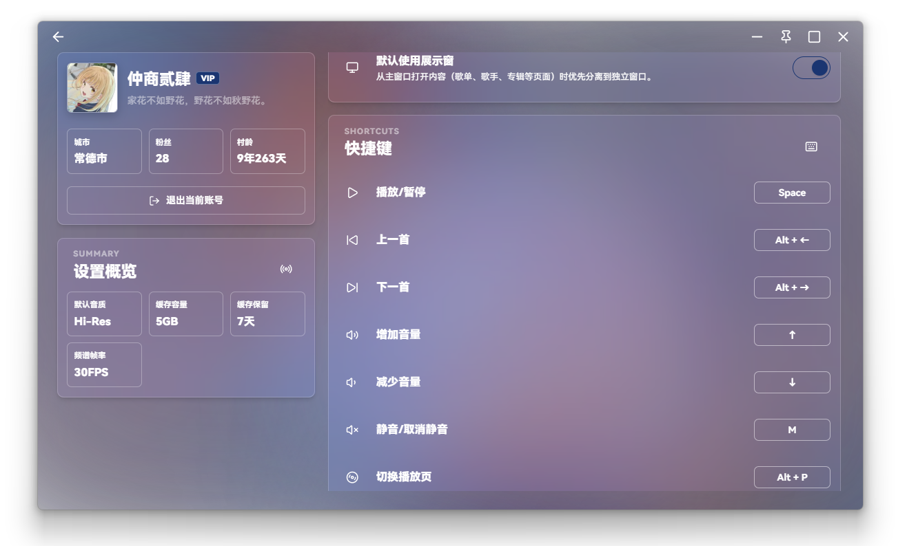
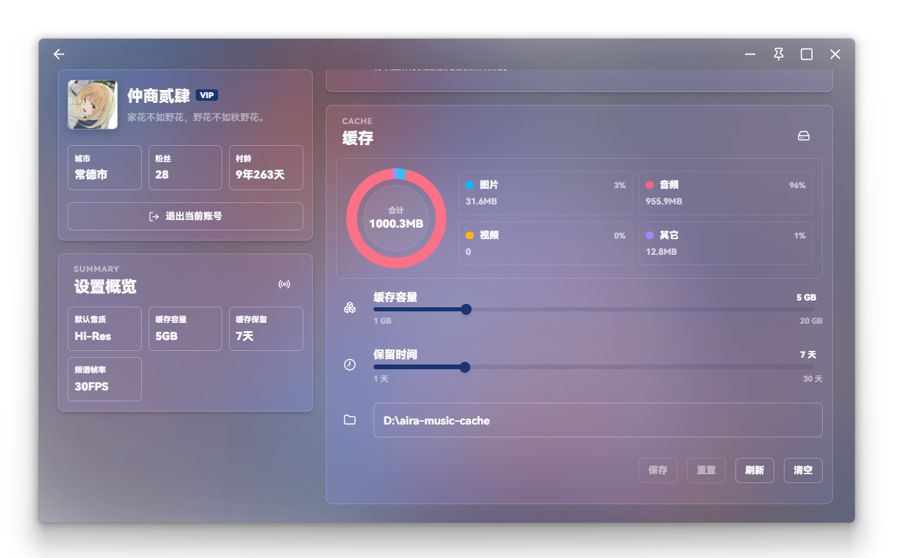
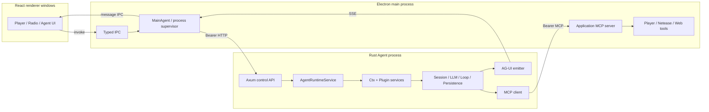

#  AiraMusic

一个面向桌面端的第三方网易云音乐播放器，也是一个探索音乐 Agent 的工程化项目。AiraMusic 以 Electron 与 React 构建多窗口播放体验，并使用 Rust Agent、Rust WASM 和 Go 本地服务承载模型循环、计算密集任务与缓存能力。

[下载](https://github.com/Ma-hiru/AiraMusic/releases) · [功能概览](#功能概览) · [音乐 Agent](#音乐Agent) · [架构设计](#架构设计) · [本地开发](#本地开发)

> [!IMPORTANT]
> AiraMusic 是非官方第三方客户端，不直接或间接提供任何音乐下载功能，推荐开通网易云黑胶会员使用。音乐 Agent 需要用户自行配置模型服务与 API Key，不附带模型额度。

## 功能概览

### 播放、发现与桌面体验

- **音乐浏览与播放**：覆盖首页推荐、搜索、歌单、专辑、艺人、评论、播放历史、队列管理和多种播放模式。
- **多种播放模式**：支持网易云私人 FM（漫游）、心动模式。
- **多窗口桌面体验**：使用十个 Vite 入口承载主界面、登录、迷你播放器、歌词、托盘、图片、评论、设置、Radio 和 Agent；多窗口之间随意拉起、关闭和同步。支持托盘控制与 Windows 任务栏封面缩略图，适配 mac 的顶栏歌词和红绿灯。
- **沉浸式视觉**：提供播放页、桌面歌词、实时音乐频谱、简单流体背景，以及基于封面 MMCQ 取色生成的动态主题。
- **计算任务异步化**：Rust/WASM 负责歌词解析与修复、FFT 频谱、主题色提取、搜索辅助和 WebGL renderer，频谱链路结合 Web Worker 避免阻塞 React 渲染。

### Agent 与开放能力

- **本地音乐 Agent**：理解当前播放内容和页面语境，调用播放器、网易云数据及网页检索能力完成多步任务，而不只是生成文本。
- **50+ 音乐工具**：覆盖资源检索、歌曲/专辑/艺人/歌单详情、歌词与评论、推荐、播放控制、队列、收藏、歌单管理、设置和网页资料核验。
- **AG-UI 流式工作区**：增量展示正文、思考、工具参数、工具结果、错误与 token usage，支持多会话并行、取消、恢复和权威快照。
- **内置 MCP 服务**：Rust Agent 通过内部凭证使用完整工具目录；外部 MCP 客户端只能访问用户在设置中显式开放的工具，高风险能力默认关闭。

## 下载与平台

前往 [Releases](https://github.com/Ma-hiru/AiraMusic/releases) 获取。安装包类型和可用平台以 Releases 页面实际提供的文件为准。

| 平台          | 当前范围             | 打包目标                    |
|-------------|------------------|-------------------------|
| Windows x64 | 主要开发与发布平台        | NSIS、MSI                |
| Linux x64   | 已配置桌面打包          | AppImage、deb、rpm、tar.gz |
| macOS arm64 | Apple Silicon 支持 | DMG                     |

## 音乐Agent

AiraMusic 内置了独立的 Agent 工作区。它不是在播放器旁边附加一个聊天框，而是把模型循环、应用上下文、音乐工具和可恢复会话组合成一个本地服务：模型能够读取当前播放状态，围绕用户目标连续检索、判断和调用工具，最终把结果以 Markdown、应用内链接和资源卡片交还给界面。目前前端界面还在优化中。

- **理解应用上下文**：感知当前播放歌曲及搜索、专辑、艺人、歌单、播放历史等页面，理解“这首歌”“这个专辑”等指代。
- **调用音乐能力**：支持资源检索、详情查询、歌词与评论读取、相似音乐与个性化推荐、播放控制、进度、音量、播放模式、队列管理和页面跳转。
- **基于证据回答**：歌曲背景与剧情分析会搜索网页并打开正文核验，站内评论只作为听众观点。
- **应用内富内容**：回复可以生成歌曲、专辑、歌单和艺人的应用内链接或资源卡片，支持查看、播放与加入队列。
- **完整运行过程**：界面按 AG-UI 增量展示正文、思考过程、工具参数、工具结果和 token usage；同一调用的增量参数与结果会按 `toolCallId` 合并展示。
- **多会话与恢复**：Rust 维护 thread/run 状态，renderer 持久化选择与恢复标记；窗口重开或事件流重连后，通过活跃 run 和 thread snapshot 恢复最终状态。

当前内置的是 **OpenAI Chat Completions 兼容 Provider**，可配置模型、上下文窗口、思考模式和自定义兼容 Endpoint。API Key 由 Rust Agent 加密持久化，所需主密钥由 Electron `safeStorage` 保护，配置接口只返回掩码。兼容服务对流式输出、思考内容、工具调用和用量统计的支持程度取决于服务自身。

### 插件优先的 Rust Agent

`packages/agent` 的设计受到 [DeepSeek Harness](https://github.com/deepseek-ai/deepseek-harness) 与 Cordis “一切皆插件”思想启发：模型、会话、工具、提示词、持久化、上下文压缩、MCP、AG-UI 和 Agent Loop 都不应固化在一个不可替换的核心中，而应作为可组合服务挂载到共享上下文。

AiraMusic 没有移植 Cordis，也不是 DeepSeek Harness 的兼容实现，而是针对 Rust 与本地桌面应用的需求现实，重新实现了一套更紧凑的符合本项目的简单插件内核：

- **共享 `Ctx`**：以线程安全服务表连接插件，通过类型化观察事件和 veto 事件扩展运行过程，而不是让模块直接互相持有具体实现。
- **`Plugin<Config, Service>`**：插件显式声明配置、提供的服务和依赖项；启动器按依赖关系完成装配，检测无法满足的依赖或循环。
- **可逆副作用**：服务注册和事件订阅都会返回 disposer，由 `Ctx` 统一记录并在退出时逆序释放。

在这一插件内核之上，项目完成了面向 Electron 的本地化适配：Rust Agent 作为受主进程监督的独立进程运行；Axum 提供带进程级鉴权的回环 HTTP/SSE；MCP 将播放器和应用能力与模型运行时解耦；`ts-rs` 生成跨语言 DTO；会话、Provider 和 API Key 使用 XChaCha20-Poly1305 加密落盘，主密钥再由操作系统 `safeStorage` 保护。

> [!NOTE]
> 收藏、评论、歌单修改和设置变更等写操作受登录状态与权限开关约束，高风险工具默认关闭。网页检索只访问公开 HTTP(S) 地址，遇到登录墙、反爬或纯脚本渲染页面时可能无法取得正文。

## 界面预览

| 多窗口                                                                                            | 播放页                                                                                   |
|------------------------------------------------------------------------------------------------|---------------------------------------------------------------------------------------|
|   |    |

| 首页                                    | 歌单                                        |
|---------------------------------------|-------------------------------------------|
|  |  |

<details>
<summary>查看更多界面截图</summary>

### 托盘与迷你播放器


### 播放页


### 歌单与播放队列





### 播放历史


### 首页


### 歌手与专辑


### 搜索


### 设置





</details>

## 架构设计

[](https://deepwiki.com/Ma-hiru/AiraMusic)

AiraMusic 是一个 Yarn Workspaces monorepo，但工作区拆分不只用于组织源码。项目把 UI、桌面宿主、Agent、缓存和计算模块放在不同运行边界中：React renderer 保持无特权，Electron 主进程负责能力编排，Rust Agent 独立执行模型循环，Go 与 Rust/WASM 分别承载本地存储服务和高频计算。


```mermaid
flowchart LR
  subgraph Renderer["React renderer windows"]
    UI["Player / Radio / Agent UI"]
  end

  subgraph Main["Electron main process"]
    IPC["Typed IPC"]
    Supervisor["MainAgent / process supervisor"]
    MCP["Application MCP server"]
    Tools["Player / Netease / Web tools"]
  end

  subgraph Rust["Rust Agent process"]
    HTTP["Axum control API"]
    Runtime["AgentRuntimeService"]
    Ctx["Ctx + Plugin services"]
    Loop["Session / LLM / Loop / Persistence"]
    Events["AG-UI emitter"]
    McpClient["MCP client"]
  end

  UI -->|invoke| IPC --> Supervisor -->|Bearer HTTP| HTTP
  HTTP --> Runtime --> Ctx --> Loop
  Loop --> Events -->|SSE| Supervisor -->|message IPC| UI
  Loop --> McpClient -->|Bearer MCP| MCP --> Tools
```

### 工作区概览

| Package           | 职责                                                                                 | 核心技术                                         |
|-------------------|------------------------------------------------------------------------------------|----------------------------------------------|
| `packages/ui`     | 多窗口渲染层，包括 `index`、`login`、`mini`、`lyric`、`tray`、`comments`、`display` 和 `agent` 等入口 | React 19、Vite 8、Tailwind CSS 4、Zustand、Jotai |
| `packages/app`    | Electron 主进程、窗口与托盘、IPC、自定义协议、子服务生命周期及打包入口                                          | Electron 42、tsup、Express、`http-proxy-3`      |
| `packages/agent`  | Agent HTTP 服务、模型与工具循环、MCP 客户端、会话持久化、AG-UI 事件和 TypeScript 客户端                       | Rust、Axum、Tokio、rmcp、AG-UI                   |
| `packages/ipc`    | Electron 主进程与各渲染窗口之间的类型化 invoke/message 契约                                         | TypeScript                                   |
| `packages/store`  | 供渲染层通过 `/cache` 使用的本地缓存服务，以及 Electron 侧进程启动器                                       | Go、Gin                                       |
| `packages/wasm`   | 歌词解析、主题与图片颜色、频谱、搜索辅助和 WebGL renderer                                               | Rust、wasm-bindgen、wasm-pack                  |
| `packages/native` | Windows 任务栏自定义封面缩略图；非 Windows 平台为空实现；mac下处理顶栏歌词                                    | Rust、napi-rs、windows-sys                     |
| `packages/log`    | 主进程和渲染层共用的日志基础能力                                                                   | TypeScript                                   |

## 本地开发

### 环境要求

- Node.js `>= 20`
- Corepack 与 Yarn `4.17.1`
- Rust stable，包含 `wasm32-unknown-unknown` target
- `wasm-pack`（CI 使用 `0.15.0`）
- Go `1.26.4`

安装 `wasm-pack`：

```bash
cargo install wasm-pack --version 0.15.0 --locked
```

### 安装与启动

```bash
corepack enable
yarn install --immutable

# 首次运行，或修改 packages/agent、wasm、native、store 后执行原生产物构建
yarn build:bin
yarn dev
```

`yarn dev` 监听 UI 和 Electron 主进程代码，但不会热编译 Rust、Go、WASM 或 native 模块；修改这些工作区后需要重新执行对应的 `build:*` 脚本。

### 构建与打包

```bash
# 构建二进制模块、Agent、桌面端，并为当前系统生成安装包
yarn build

# 已完成各工作区构建时，仅重新执行指定平台的打包阶段
yarn build:electron:win32
yarn build:electron:linux
yarn build:electron:darwin
```

Go、Rust 原生产物和 Electron 安装包应在对应目标系统上构建。macOS 当前仅配置 arm64 DMG。

### 质量检查

```bash
yarn check
yarn lint:check
yarn test
```

CI 会检查 TypeScript、Go、Rust/WASM 和各工作区测试，并构建 UI 与 Electron 主进程 bundle。

## License

AiraMusic 基于 [MIT License](LICENSE) 开源。使用第三方音乐服务时，请同时遵守相应服务条款与所在地法律法规。
